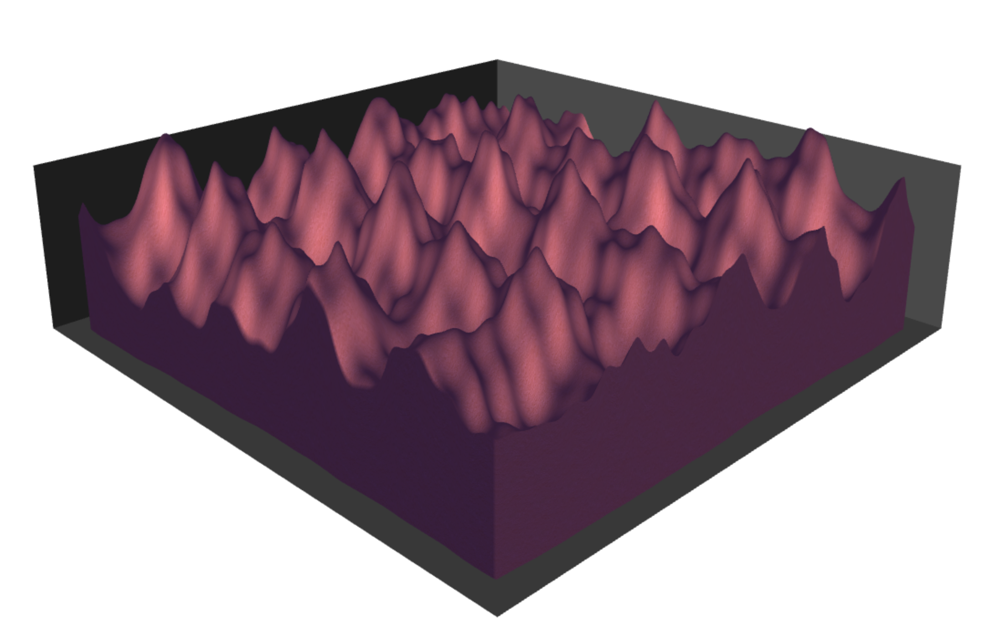

# [WebGL Water Simulation](https://gtongue.github.io/WebGLWater/)


Original code by @gtongue at https://github.com/gtongue/WebGLWater

Modified by @dkillough and @NateD247 for CS 354 Computer Graphics

## Overview

WebGL Water Simulation is a visualization of waves. Rendered using WebGL and GLSL.

## Features

- ### Control Wave Properties
  Use the available sliders to change how the wave displays
  - Amplitude
  - Frequency
  - Wavelength
  - Steepness
  - Color
  - Transparency


- ### Moving Camera
  Use the arrow keys to rotate the view or tilt the camera up and down
- ### Wireframe View
  Check the box at the top to enable wireframe mode.


## Gerstner Waves
To generate the wave I use grestner waves. This allows me to have steep peaks on the waves instead of always curved like a normal sign wave.
- S = Steepness 
- A = Amplitude 
- W = Wavelength 
- F = Frequency
- D = Direction

```glsl
void gerstnerWave(float S, float A, float W, float F, vec2 D){
  float w = 2.0*3.141592/W;
  S = S * steepness;
  float Q = S / (w * A);
  float dotD = dot(position.xz, D);

  float cosine = cos(w * dotD + time * F);
  float sine = sin(w * dotD + time * F);

  vec3 wave = vec3(position.x + (Q * A * D.x * cosine) , A * sine, position.z + (Q * A* cosine * D.y));

  waves += wave;

  vec3 waveNormal = vec3((D.x * w * A * cosine), 1.0 - (Q * w * A * sine), -(D.y * w * A * cosine));

  waveNormals +=  waveNormal;
  numWaves++;
}
```

Here are examples of this function being used to generate multiple waves
- The amplitude, wavelength, and frequency here are the values from the sliders
```glsl
gerstnerWave(1.0, amplitude*.3, wavelength, frequency, vec2(0.0,1.0));
gerstnerWave(1.0, amplitude*.2, wavelength, frequency, vec2(.3,.7));
gerstnerWave(1.0, amplitude*.3, wavelength, frequency*.7, vec2(.8,.2));
```

## Housekeeping

`Proposal.md` notes @gtongue's original project reposal, including the technologies used.

Since this project was initially created in 2018, many of the dependencies need to be updated. 
@dkillough has updated the following:
- .gitignore now includes package-lock.json
- typo in wireframeOn() method call
- updated package file for April 2022
- updated webpack config file for webpack 3.0+ (module.rules instead of module.loaders)
  - Random person on the internet:
  If you're getting `Invalid configuration object. Webpack has been initialized using a configuration object that does not match the API schema` error, check out our `webpack.config.js` file on line 14 and 15. If yours says `module:` and then `loaders:`, change "loaders" to "rules".

## Cloning and running the repository
* `git clone <link>` as you would a normal repo
* install the npm cli if you don't have it already (should be bundled with node.js)
* `npm i -g webpack webpack-cli`: installs webpack, the bundling manager, if you don't already have this as well
* `npm i`: install dependencies from `package.json` file

## Making changes
- Edit code as necessary
- Run `webpack` in terminal **from the root** of the directory to bundle code into `bundle.js`
- Open `/index.html` in web browser of choice (tested working in Firefox 99.0.1)

## General file structure
### /dist/
Distribution folder; includes `bundle.js` file, which is the created javascript bundle for the web application. Used in `index.html` and generated by `webpack`.

### /lib/shaders


### /lib/webgl
